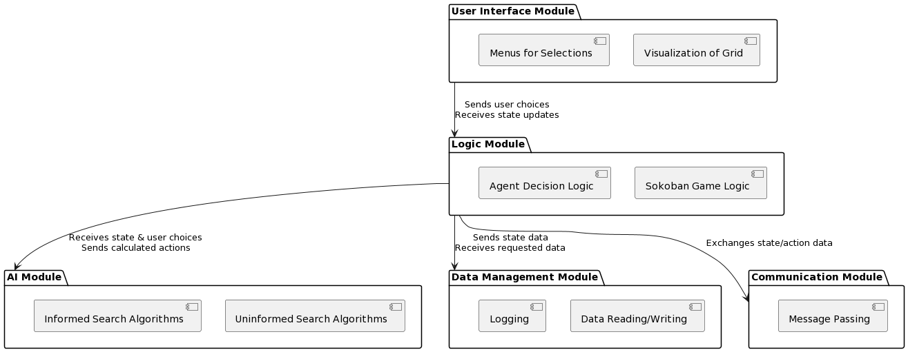

# Documentation

## Table of Contents

- [Documentation](#documentation)
  - [Table of Contents](#table-of-contents)
  - [Introduction](#introduction)
  - [Usage](#usage)
  - [Modules](#modules)
  - [Testing](#testing)
  - [Diagrams](#diagrams)
    - [Packages Diagram](#packages-diagram)
    - [Class Diagram](#class-diagram)

## Introduction

TODO

## Usage

TODO

## Modules

TODO

## Testing

TODO

## Diagrams

### Packages Diagram

  ```plantuml
  @startuml
  !define RECTANGLE class

  package "SokobanAI" {
    [Main]
    [Menu]
    [Simulation]
  }

  package "SearchAlgorithms" {
    [BreadthFirstSearch]
    [DeepFirstSearch]
    [UniformCostSearch]
    [BeamSearch]
    [HillClimbing]
    [AStarSearch]
  }

  package "Heuristics" {
    [Manhattan]
    [Euclidean]
  }

  package "Agent" {
    [Robot]
    [Wall]
    [Floor]
    [Box]
    [Target]
  }

  package "World" {
    [Map]
  }

  [Main] --> [Menu]
  [Main] --> [Simulation]
  [Simulation] --> [Agent]
  [Simulation] --> [World]
  [Simulation] --> [SearchAlgorithms]
  [SearchAlgorithms] --> [Heuristics]

  @enduml
  ```

  

### Class Diagram

  ```plantuml
  ```
